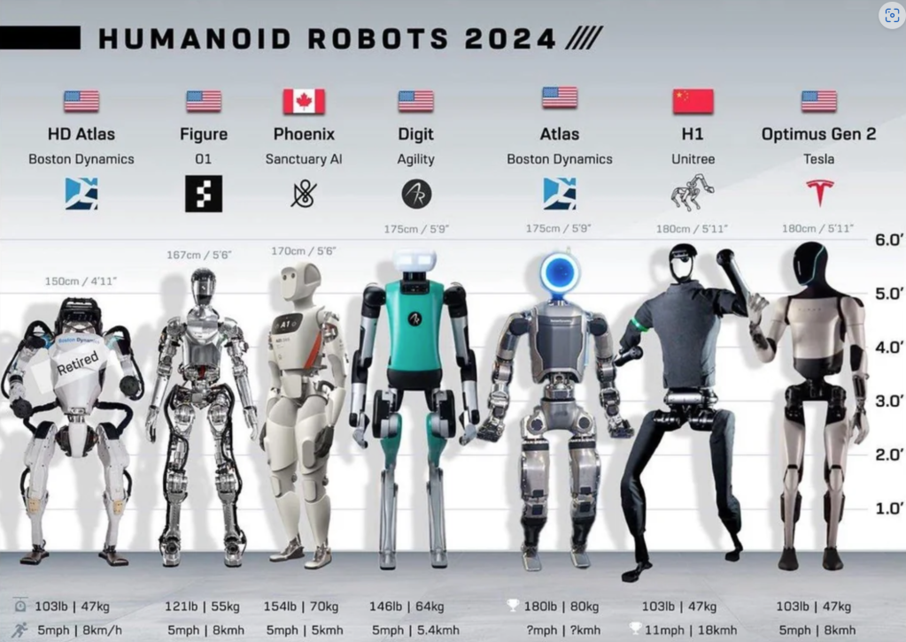

> 내가 먼저 엿보고 온 시간들. 그 시작점은 RFM이었다.

---

## RFM이란?

**RFM(Robot Foundation Model)** 은 텍스트, 비전, 행동(action) 등 다양한 멀티모달 입력을 통합하여  
로봇이 상황을 이해하고, 판단하고, 스스로 움직일 수 있게 해주는 범용 인공지능 모델이다.

GPT가 언어의 뇌라면, RFM은 로봇의 **시각·행동까지 포함된 진짜 두뇌**라고 할 수 있다.

---

## 왜 RFM이 중요한가?

기존 로봇은 대부분 특정 작업만 하도록 프로그래밍되었다.  
하지만 RFM은 다음과 같은 특징을 갖는다:

- 💡 다양한 상황에 적응할 수 있는 **범용성**
- 🧠 사전 학습을 통해 빠른 행동 실행이 가능한 **추론 기반 구조**
- 🔄 실제 환경에서의 fine-tuning 없이도 행동 가능

> 기존 방식: Rule-based task-specific →  
> RFM 기반: One-model for many-tasks

---

## 어떤 기술이 결합되는가?

RFM은 다음과 같은 핵심 기술이 통합되어 구성된다:

- 🧠 **LLM (Large Language Model)** – 언어 기반 추론
- 👁 **Vision Model** – 객체 인식, 상황 이해
- 🦿 **Action Model / Reinforcement Learning** – 동작 결정
- 🔗 **멀티모달 Transformer** – 모든 입력의 통합 처리

---

## 주요 기업/플랫폼

현재 RFM 기술은 다음과 같은 글로벌 기업들이 선도하고 있다:

- **[Google DeepMind](https://deepmind.google/)** – RT-1, RT-2, RT-X, Gemini Robotics
- **[NVIDIA](https://www.nvidia.com/en-us/robotics/)** – GR00T, Omniverse, Isaac Sim
- **[Tesla](https://www.tesla.com/optimus)** – Optimus
- **[Figure AI](https://www.figure.ai/), [1X](https://www.1x.tech/), [Sanctuary AI](https://www.sanctuary.ai/)** – 고성장 스타트업들

이 이미지는 현재 대표적인 휴머노이드 로봇들의 스펙을 비교한 것이다.  
키, 무게는 유사하지만 각 로봇의 구현 방식은 다르고, RFM이 이 차이를 결정짓는 요인이 될 가능성이 높다.

---

## 앞으로 어떤 세상이 올까?

- 📱 스마트폰처럼 RFM도 범용 OS화될 것
- 🛠 메카닉은 부품처럼 교체 및 업그레이드
- ☁️ 컴퓨팅 자원은 클라우드+엣지 구조로 탄력 운영
- 🧠 액션 모델은 Store처럼 다운로드

---

## 마치며

이 블로그는 **RFM을 따라 미래를 엿보는 여정**이다.  
그리고 이 글은 그 첫 페이지.

> “나는 먼저 엿보고 왔다. 그래서 기록을 남긴다.”